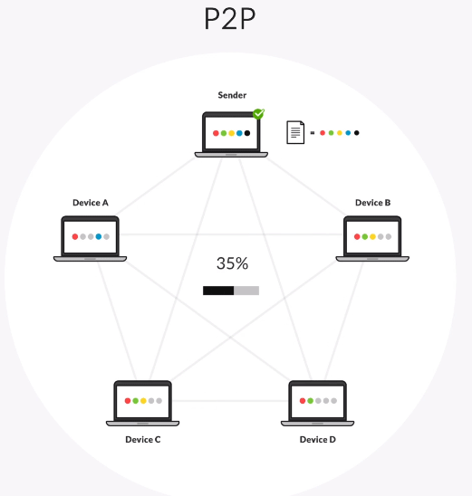

# Architecture P2P

## Rappels

- Une Architecture Client-Serveur est un modèle où un client (ordinateur ou application) demande des services ou des données à un serveur centralisé, qui
  répond aux requêtes. Exemple : Un utilisateur accède à une page web via un navigateur (client), le serveur web lui fournit la page.

- Une Architecture microservices décompose le système en plusieurs services indépendants et autonomes, pouvant être déployés sur des noeuds distants.

## Architecture Peer-to-Peer (P2P)

Une architecture P2P combine certains aspects de ces deux architecture:

- Chaque noeud (ou "peer") agit à la fois comme client et serveur
- Les peers sont généralement déployés sur des machines distinctes, reliées entre elles par un réseau de communication commun
- On les nomme "peers" parce qu'ils ont tous les mêmes fonctionnalités

C'est une forme d'architecture distribuée. Elle présente donc les mêmes avantages et inconvénients que l'architecture microservices.  
Elle a toutefois l'inconvénient de limiter l'évolutivité fonctionnelle puisque tous les noeuds sont similaires et doivent donc tous implémenter toutes les fonctionnalités recherchées.

Exemple : Partage de fichiers via BitTorrent.

## Conclusion

Le choix entre P2P et Client-Serveur dépend des besoins spécifiques du système (scalabilité, coût, sécurité). Les deux
architectures ont leurs usages particuliers et se complètent souvent dans des environnements modernes.
