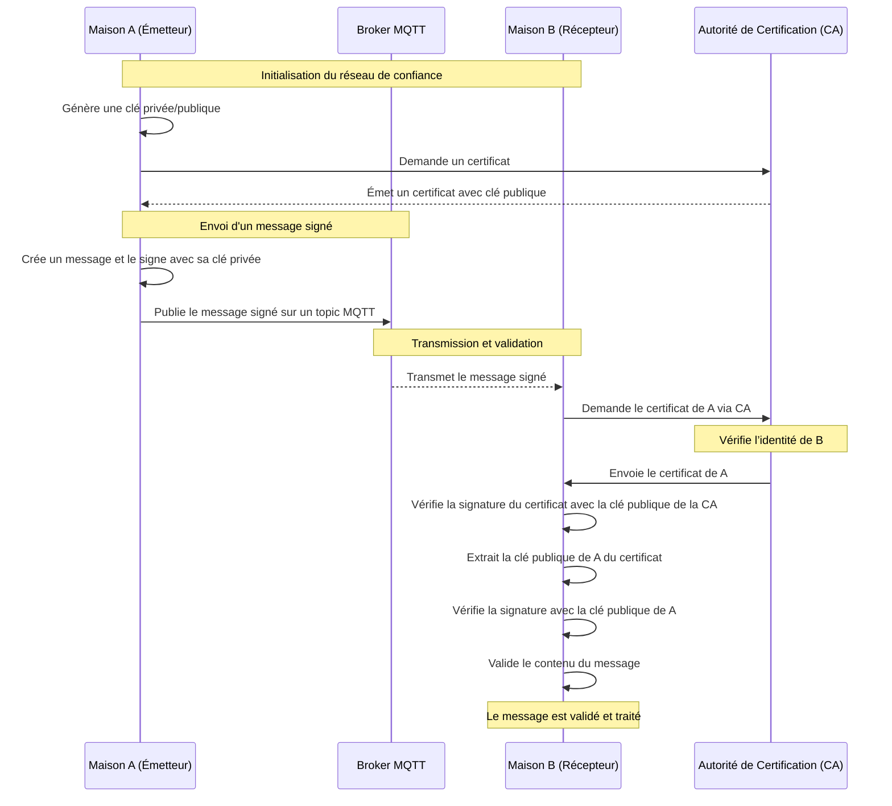

# Réseau de confiance

Un **réseau de confiance** est un modèle dans lequel chaque participant (par exemple, une maison connectée ou un
appareil IoT) accorde sa confiance à d'autres participants sur la base de relations directes ou indirectes. Cette
confiance est essentielle pour assurer la validité des échanges.

## 2 aspects fondamentaux
Pour réaliser un réseau de confiance, au moins deux élements sont à prendre en compte : 

### Identité
Chaque nœud doit pouvoir être identifié et reconnaissable, du point de vue des deux partenaires d'un échange:
- Le récepteur est certain de l'identité de l'émetteur
- L'émetteur ne peut pas prétendre ne pas être à l'origine du message

On parle alors de **non-répudiation**, ce qui implique une
architecture de type PKI.

Cela passe donc par des **certificats de confiance** :

- Les nœuds possèdent des certificats émis par une autorité centrale ou décentralisée.
- Chaque certificat associe une identité à une clé publique.

tout en permettant la **propagation de la confiance** :
- Les relations de confiance peuvent être directes (maison A connaît maison B) ou transitives (A fait confiance à B,
  qui fait confiance à C).

ce qui implique une **validation mutuelle** avant de partager des informations.

### Validité

Même si l’identité d’un nœud est vérifiée cryptographiquement, le réseau doit également s’assurer que les actions de ce nœud respectent les règles communes.  
Cela nécessite des mécanismes de contrôle, de traçabilité et éventuellement de consensus distribué, afin de détecter ou prévenir les comportements frauduleux.

#### Importance du logging

On peut par exemple imaginer analyser les logs quotidiens pour détecter des opérations illicites...  
On centralise la fonctionnalité de logging dans un microservice. Avec des messages chiffrés de manière asymétrique, on assure la non-répudiation des logs. 
Un outil d'analyse peut ensuite être mis en place pour vérifier les opérations effectuées.

## Exemple d'application avec PKI (Public Key Infrastructure)

1. **Établissement de la confiance** :
    - Chaque maison s'enregistre auprès d'une autorité de certification (CA, par exemple Verisign...) pour obtenir un certificat X.509, qui contient sa clé publique.
    - Ces certificats peuvent être validés par d'autres maisons avant de commencer les échanges.

2. **Signature des messages MQTT** :
    - Les messages envoyés via le broker sont **signés** avec la clé privée de l’émetteur.
    - Exemple : Une maison publie un message sur le **topic "powercher"**, accompagné de la signature de son
      contenu.

3. **Vérification au niveau du broker ou des abonnés** :
    - Les abonnés (maisons connectées) utilisent la clé publique de l’émetteur (disponible via le certificat) pour
      valider la signature et s'assurer que :
        - Le message provient bien de l’émetteur déclaré.
        - Les données n’ont pas été modifiées en transit.

4. **Gestion des fichiers multimédias** :
    - Les fichiers sont hachés (ex. SHA-256) avant transmission.
    - Le hachage est signé.

### Diagramme de séquence

### Défis et solutions de la version PKI

1. **Gestion des certificats** :
    - Problème : Distribution et révocation des certificats.
    - Solution : Utiliser un protocole comme [**OCSP (Online Certificate Status Protocol)**](https://www.fortinet.com/fr/resources/cyberglossary/ocsp) pour vérifier l’état des
      certificats.

2. **Latence et overhead** :
    - Problème : Les opérations cryptographiques peuvent augmenter la latence.
    - Solution : Optimiser les algorithmes (ex. ECDSA au lieu de RSA) et utiliser des matériels dédiés (ex. puces TPM).

3. **Confiance initiale** :
    - Problème : Établir un réseau de confiance initial sans point central fort.
    - Solution : Modèle hybride avec une autorité initiale décentralisée ou une blockchain.

