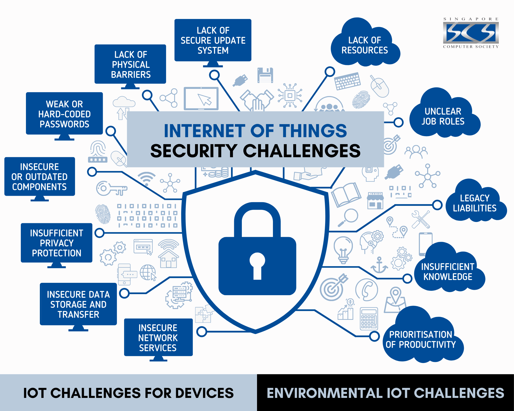

# Sécurité dans un réseau distribué

## 2 éléments clés

Malgré les opportunités présentées dans l’image, nous allons nous limiter à 2 éléments clés 🔑 :

1. Confidentialité
2. Réseau de confiance

## Théorie 📖

- [Concepts fondateurs](../supports/securite.md)
- [Confidentialité](../supports/confidentialite.md)
- [Réseau de confiance](../supports/reseau-confiance.md)
- [Kahoot confidentialité/confiance](https://create.kahoot.it/share/321-confidentialite-confiance/9fdf010f-682c-42c5-bc7e-2188d553bebd)

## Pratique 👷

### PowerCher

- Revue du projet PowerCrypt
  - Classe PowerKey
  - Classe statique `AESEncryptionHelper` (symmétrique)
    - Doit être initialisée avant d'être utilisée
    - Utilise une clé symmétrique qui est dans le dossier `%localappdata%\Powercher\Keys`
  - Classe statique `RSAEncryptionHelper` (asymmétrique)
    - Doit être initialisée avant d'être utilisée
    - Utilise des clés nommées d'après une identité, également stockées dans `%localappdata%\Powercher\Keys`
    - Permet de signer et de vérifier la signature d'un objet
  - Test unitaire échoue : on n'a pas défini notre identité --> en créer une en se servant de de son House.UniqueName
  - Partager sa clé publique dans le [canal Teams](https://eduvaud.sharepoint.com/:f:/r/sites/ETML_FID-24-26_Teams-I321-XCL/Documents%20partages/I321-XCL/Cl%C3%A9s%20publiques?csf=1&web=1&e=fOt1Bs)

- Objectif:
  - Signer sa commande de réponse à PowerWatch et obtenir le badge !

- Définir une clé de chiffrement symétrique commune et chiffrer les messages. Voir [consignes](../activites/aie_confiance/)
